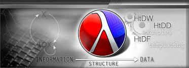

# Systematic Programe Design Course On edx

 

## Description

This repository contains my attempts at solving the problem sets from the Systematic Program Design course. When I started this course, I had only a little programming knowledge, so it reflects part of my learning journey.

Course Link: https://learning.edx.org/course/course-v1:UBCx+SPD1x+2T2015
